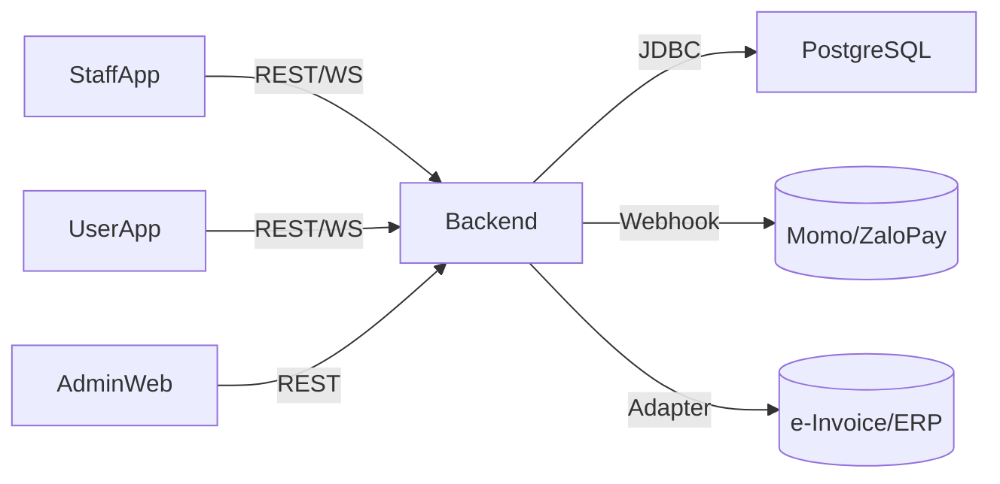

# Billiard Club Management – Full Project Report

## 1) Overview
Hệ thống quản lý câu lạc bộ bida gồm:
- Đặt bàn, quản lý trạng thái bàn (trống/đang chơi/đặt trước)
- Tính tiền giờ theo khung giá (cao điểm/thấp điểm/ngày lễ)
- Order F&B, gộp vào hóa đơn
- Thanh toán (tiền giờ + F&B), chia/gộp/chuyển bàn
- Loyalty (tích điểm, hạng, voucher, khuyến mãi)
- Báo cáo vận hành
- Mở rộng: giải đấu, huấn luyện viên, IoT
- Đa công ty (Company) → nhiều câu lạc bộ (Club) → nhiều bàn

## 2) Tech Stack
- **Backend**: Java Spring Boot 3, JPA/Hibernate, PostgreSQL, Flyway, WebSocket/STOMP, JWT, Docker
- **Frontend (Mobile/Web)**: Flutter (Provider + Repository pattern), Flutter Web cho Admin
- **Payments**: Momo, ZaloPay (phase sớm); webhook xác nhận
- **Accounting/E-Invoice**: kiến trúc adapter (chưa chốt vendor)
- **API**: OpenAPI (Swagger) → sinh client Dart (dart-dio)
- **Mock**: Prism/Mockoon cho FE trước khi có BE
- **CI/CD**: GitHub Actions, Docker Compose; hướng cloud sau
- **Infra**: Localhost Docker → Raspberry Pi 5 (ARM) → Cloud

## 3) Business Requirements (rút gọn)
- Đặt bàn: xem bàn trống, giữ bàn, no-show rules, đặt cọc (sau)
- Tính giờ: start/stop/pause, làm tròn 15’/30’, phụ thu, combo giờ
- F&B: menu, order theo bàn/phiên, in bar/KDS (sau)
- Hóa đơn: tách/gộp/chuyển bàn, khuyến mãi, voucher, e-receipt
- Loyalty: tích điểm/hạng, chương trình ưu đãi theo khung giờ
- Báo cáo: doanh thu theo giờ/ngày, best-seller, công suất theo club
- Multi-tenant: Company → nhiều Club, mỗi Club 10–100 bàn
- i18n: vi-VN & en-US (mở rộng được)

## 4) Architecture (tổng thể)
- Client (Staff App, User App, Admin Web) ↔ **Backend REST + WebSocket**
- Backend ↔ PostgreSQL, Redis (optional cache/session)
- Payment providers (Momo/ZaloPay) qua REST + Webhook
- (Tương lai) Adapter kế toán/e-invoice
- OpenAPI ở trung tâm để codegen và contract test



## 5) Repository Layout (monorepo hybrid, không Melos)
```
bida-club/
├─ backend/
├─ apps/
│  ├─ staff_app/
│  ├─ user_app/
│  └─ admin_web/
├─ packages/
│  ├─ core_ui/
│  ├─ core_domain/
│  ├─ core_data/
│  └─ api_client/
├─ api/
│  ├─ openapi.yaml
│  └─ mock/
├─ devops/
│  ├─ docker-compose.yml
│  └─ nginx.conf
└─ docs/
   ├─ PROJECT_PLAN.md
   ├─ ARCHITECTURE.md
   └─ CONVENTIONS.md
```

### Backend structure
```
backend/src/main/java/com/acme/bida/
  config/  auth/  table/  pricing/  booking/  product/
  order/   billing/  loyalty/  report/  integration/
resources/db/migration (Flyway)
test/... unit + integration (Testcontainers) + contract
```

### Flutter app structure (ví dụ staff_app)
```
lib/
  app.dart, main.dart, core/ (router, di, env)
  features/
    auth/ table/ booking/ order/ billing/ loyalty/
```

### Shared packages (Flutter)
- **core_domain**: entities, usecases, abstract repositories
- **core_data**: dio client, datasources, repository impl, mappers
- **api_client**: OpenAPI codegen (dart-dio)
- **core_ui**: theme, atoms/molecules/organisms

## 6) Multi-Tenancy Design
- Mọi bảng có `company_id`, `club_id`
- RBAC: Owner(Admin Company), Club Manager, Staff, Customer
- Index theo `club_id`, `table_id`, thời gian
- Filter tenant ở repository/service (guard mọi truy vấn)

## 7) Realtime (Trạng thái bàn đang sử dụng)
- **Spring WebSocket + STOMP**: topic ví dụ `/topic/clubs/{clubId}/tables`
- Khi phiên start/stop/pause/order → publish event → client subscribe UI
- Có thể dùng Spring WebFlux/RSocket nếu cần reactive sâu

## 8) Payments (Momo, ZaloPay)
- `PaymentService` (interface) → `MomoPaymentService`, `ZaloPayPaymentService`
- Flow: Create payment (amount, billId, returnUrl) → redirect → **Webhook** xác nhận → update bill & emit WS event
- Lưu `payment_attempts` (status, payload, signature)
- Retry & idempotency key cho webhook

## 9) Accounting / E-Invoice (Adapter-ready)
- `AccountingService` interface; adapter cấu hình theo Company
- Chuẩn hóa `InvoiceDTO` và `JournalEntryDTO`
- Khi chốt bill: tạo “invoice draft” nội bộ; nếu Company cấu hình → push ra hệ thống kế toán

## 10) API Spec (OpenAPI – stub rút gọn)
```yaml
openapi: 3.0.0
info: { title: Billiard Club API, version: 1.0.0 }
paths:
  /auth/login: { post: { summary: Login } }
  /companies: { post: { summary: Create company }, get: { summary: List companies } }
  /clubs: { post: { summary: Create club }, get: { summary: List clubs } }
  /tables: { get: { summary: List tables by club } }
  /bookings:
    post: { summary: Start session }
    patch: { summary: Pause/Resume/Stop }
  /orders: { post: { summary: Add F&B to session } }
  /billing/checkout: { post: { summary: Close and pay bill } }
  /payments/momo: { post: { summary: Create payment } }
  /payments/zalopay: { post: { summary: Create payment } }
  /webhooks/momo: { post: { summary: Momo webhook } }
  /webhooks/zalopay: { post: { summary: ZaloPay webhook } }
components:
  schemas:
    Table: { type: object, properties: { id: {type: string}, clubId: {type: string}, status: {type: string} } }
```

## 11) Testing Strategy
**Backend**
- Unit: JUnit5 + Mockito (pricing rules, billing)
- Integration: `@SpringBootTest` + **Testcontainers** (Postgres/Redis)
- Contract: Pact (consumer = FE; provider = BE)
- API collections: Postman/Newman hoặc Karate trong CI
- Webhook tests: giả lập callback, verify signature

**Frontend**
- Unit/Widget: `flutter_test` + `mocktail`
- Golden: `golden_toolkit`
- Integration/E2E: `integration_test` (+ Patrol/Maestro tùy chọn)
- Mock API: Prism/Mockoon hoặc `http_mock_adapter` cho Dio

## 12) Development Flow (cuốn chiếu)
1. Brainstorm features → viết user stories + acceptance criteria
2. Define API (OpenAPI) → mock bằng Prism
3. FE implement với mock → review UX
4. BE implement logic + test (unit/integration/contract)
5. FE chuyển sang gọi BE thật (staging)
6. E2E test (staging) → UAT → release
7. Thu feedback → đưa vào phase kế tiếp

## 13) Phase Plan
**Phase 1 – Core + Multi-tenant**
- Company/Club (CRUD), Auth/RBAC
- Tables, Booking (start/stop/pause), Pricing cơ bản
- Order F&B, Billing (checkout), Report cơ bản
- Staff App (core), Admin Web (CRUD), User App (basic read)
- WS realtime trạng thái bàn
- (Tuỳ chọn) Khởi tạo thanh toán Momo/ZaloPay (create + webhook)

**Phase 2 – Loyalty + Dynamic Pricing**
- Loyalty (điểm, hạng), Khuyến mãi theo khung giờ
- Dynamic pricing (peak/off-peak)
- Báo cáo nâng cao

**Phase 3 – Nâng cao**
- Tồn kho F&B, giải đấu/coach, đa chi nhánh nâng cao
- Dashboard phân tích, heatmap công suất

**Phase 4 – Automation/IoT**
- Cảm biến bàn → auto start/stop
- Online payments hoàn thiện

## 14) Deployment Strategy
- **Local**: `docker-compose up` (db + backend); FE dùng mock hoặc staging
- **Raspberry Pi 5**: build **multi-arch images** (`linux/arm64`), Caddy/Nginx reverse proxy, HTTPS (Let’s Encrypt)
- **Cloud**: chọn VPS/K8s; bật autoscaling (sau)
- Env:
  - `DB_URL`, `JWT_SECRET`, `PAYMENT_*` keys, `ALLOWED_ORIGINS`
- Logging/Monitoring: Micrometer + Prometheus/Grafana, ELK (tùy)

## 15) Security & Observability
- HTTPS, CORS whitelist theo domain club/admin
- JWT access + refresh, role-based (Owner/Manager/Staff/Customer)
- Rate limit endpoints nhạy cảm (payment, login)
- Audit log: thay đổi giá, void/comp
- Metrics: request latency, error %, event bus (WS) throughput

## 16) Source Code Guidelines
- BE: package-by-feature; DTO ↔ Entity mappers; service thin controller
- FE: Repository + Provider; tách core_domain/core_data
- Naming API REST: danh từ số nhiều; lỗi theo schema `{error.code, error.message}`
- Migrations: Flyway V1__init.sql, V2__...
- Tests: phải có khi mở PR; CI chạy test & linter

---
**Notes**
- Không cần offline mode (Pi có public IP).
- Chưa chốt vendor kế toán → giữ adapter, chuẩn hóa invoice DTO.
- Hỗ trợ 1–100 club; 10–100 bàn/club; index theo `club_id`, `table_id`, thời gian.
